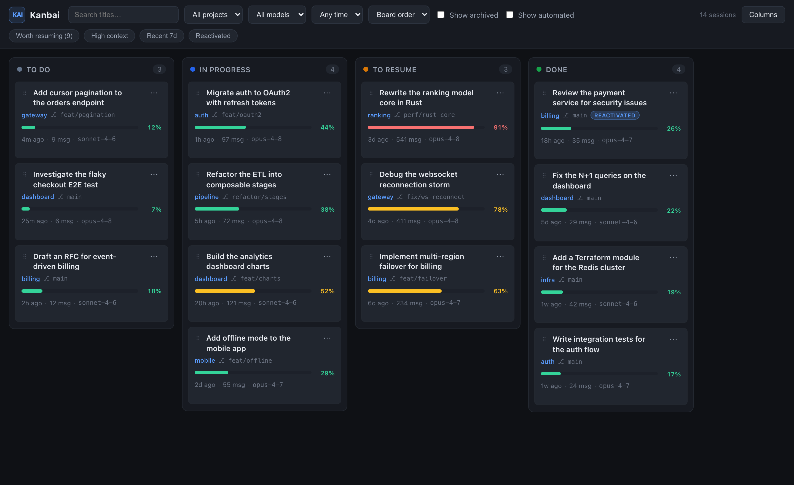

# Kanbai

[](https://github.com/ferdinandobons/kanbai/actions/workflows/ci.yml)
[](https://github.com/ferdinandobons/kanbai/releases/latest)

**A read-only, localhost Kanban board for your [Claude Code](https://claude.com/claude-code) sessions.**



Every Claude Code session holds the full context of your work — the reasoning, the diffs,
the decisions. Starting a fresh session means throwing that away. Kanbai scans every
session under `~/.claude/projects/` and lays them out on a Kanban board so you can see, at
a glance, **which conversations are done and which are still worth resuming**.

Drag a card between columns to track its state. Columns are fully customizable. The board
updates **live** — the backend watches your session files and pushes changes over
Server-Sent Events.

> **Read-only by design.** Kanbai never starts, resumes, or edits your sessions. It only
> reads files under `~/.claude/projects/`. The Kanban state lives in a separate local file
> (`data/store.json`), never inside your sessions directory. The single write under the
> sessions directory is the explicit **Delete permanently** action, which removes one
> `.jsonl` file after a confirmation modal.

## Features

- **Every session, every project** — auto-discovers all sessions across all projects, with
  filters by project, model, date range, and a title search.
- **Context-usage at a glance** — each card shows the **% of the model's context window**
  used (green / amber / red), computed from the session's token usage.
- **Rich cards** — title (from the session's AI-generated title, with smart fallbacks),
  project + git branch, last activity, message count, and model.
- **Details & rename** — click a card for a full-detail modal (project path, branch, model,
  context, full last prompt, session id) and **rename its title** right there. The rename is
  stored as an override in `data/store.json` — your session files are never modified, and a
  *Reset to original* is one click away.
- **Copy resume command** — one click on a card copies `cd <path> && claude --resume <id>`
  to your clipboard. Kanbai stays read-only — it hands you the command, you run it.
- **Triage: "Worth resuming"** — a built-in ranking (high context + recent + reactivated)
  surfaces the sessions actually worth reopening, with a one-click filter and a count badge.
- **Sort, quick filters & deep links** — sort by last activity / context % / messages /
  created (remembered across reloads), one-tap chips (Worth resuming, High context, Recent,
  Reactivated), and shareable `?session=<id>` links that open a card on load.
- **Customizable columns** — rename, add, reorder, and delete columns; the defaults are
  *To do / In progress / Done*.
- **"Reactivated" detection** — a card you moved to a done column that later receives new
  activity gets flagged, so a "finished" session that came back to life never slips by.
- **Two distinct cleanups** — *Archive* hides a card while keeping the file intact;
  *Delete permanently* removes the `.jsonl` from disk (guarded + confirmed).
- **Hides the noise** — programmatic/agent sessions (no AI title + a JSON-payload first
  message, e.g. plugin observers) are detected and hidden by default; a one-click
  *Show automated* toggle brings them back.
- **Live updates** — new sessions appear and existing ones refresh in real time via SSE.

## How it works

A Claude Code session is a `~/.claude/projects/<project>/<uuid>.jsonl` file. Kanbai parses
each one into a card (title, model, context %, message count, last activity, git branch),
merges it with your Kanban placement from `data/store.json`, and serves it to the board.
A `chokidar` watcher streams additions, changes, and removals to the UI.

## Live updates (SSE)

The board stays in sync over a single **Server-Sent Events** stream at `GET /events`.
The browser subscribes once on load (`EventSource`) and the backend pushes a JSON event
on every change — no polling. Each message is a JSON object with a `type`:

| Event | When | Payload |
| --- | --- | --- |
| `session.added` | A new `.jsonl` session appears under `~/.claude/projects/`. | `{ session }` (a parsed `SessionMeta`). |
| `session.updated` | An existing session file changes (new activity, context, title…). | `{ session }`. |
| `session.removed` | A session file is unlinked (or **Delete permanently** runs). | `{ id }`. |
| `store.changed` | The Kanban state changes — a card move/archive/rename or a column add/rename/reorder/delete. | `{ store }` (the full board snapshot, including the authoritative `doneColumnId`). |

The client also surfaces two synthetic connection events (not sent by the server) so a dead
stream is never silent:

- `connection.open` — the stream (re)connected; clears any disconnect notice.
- `connection.error` — an error occurred. When the browser will **not** auto-reconnect
  (`readyState === CLOSED`), the event carries `fatal: true`.

On a fatal disconnect the UI shows a **"Live updates disconnected — the board may be out of
date. Refresh to reconnect."** banner; a successful reconnect (`connection.open`) clears it.

## Install

From the repository root:

```bash
npm install
```

This installs the root tooling and both the `server/` and `web/` npm workspaces.

## Run

```bash
npm run dev
```

Starts the backend on **http://localhost:4319** and the Vite dev server on
**http://localhost:5319** (which proxies `/api` and `/events` to the backend).
Open **http://localhost:5319**.

### Production build

```bash
npm run build   # builds web/dist
npm start       # backend serves web/dist as static on :4319
```

### Environment overrides

| Variable | Default | Purpose |
| --- | --- | --- |
| `KANBAI_PORT` | `4319` | Backend HTTP port. |
| `KANBAI_PROJECTS_DIR` | `~/.claude/projects` | Sessions directory to read (point it at an isolated dataset for tests/demos). |
| `KANBAI_STORE_PATH` | `data/store.json` | Where the Kanban state is persisted. |

## Test

```bash
npm test   # server (node --test) + web (vitest)
```

## Stack

- **Backend:** Node + Fastify (ESM), `chokidar` file watcher, SSE, JSON store.
- **Frontend:** React + Vite + dnd-kit.

## Project layout

```
kanbai/
  package.json            # root: npm workspaces + dev/build/test scripts
  server/                 # Fastify backend (parser, scanner, store, watcher, sse, routes)
  web/                    # React + Vite + dnd-kit frontend
  data/                   # store.json — Kanban state (gitignored)
  assets/                 # README hero image
```
